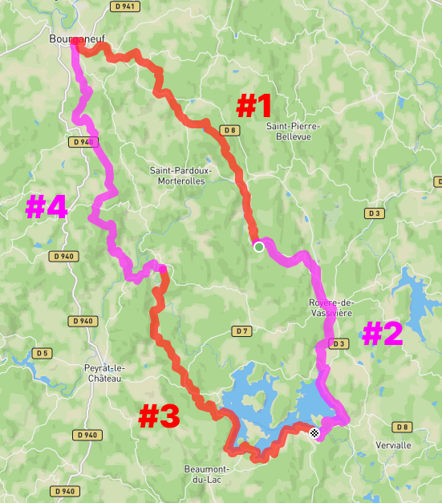

# Randonnée plateau de Millevaches

Sur la base de [cette carte](https://rando-millevaches.fr/trek/730247-GRP%C2%AE65-Cascades,-landes-et-tourbieres),
importée [ici dans komoot](https://www.komoot.com/fr-fr/tour/1756525362), il est 
proposé ce découpage : 

## étape #1
Bourganeuf - Le Picq  
17,5 km  
[komoot.com/tour/1756659979](https://www.komoot.com/tour/1756659979)

## étape #2
Le Picq - Les Terrasses du Lac  
15,2 km  
[komoot.com/tour/1756687454](https://www.komoot.com/tour/1756687454)

## étape #3
Les Terrasses du Lac - Saint Martin Château  
20,3 km  
[komoot.com/tour/1756712245](https://www.komoot.com/tour/1756712245)

## étape #4
Saint Martin Château - Bourganeuf  
19,0 km  
[komoot.com/tour/1756723134](https://www.komoot.com/tour/1756723134)
