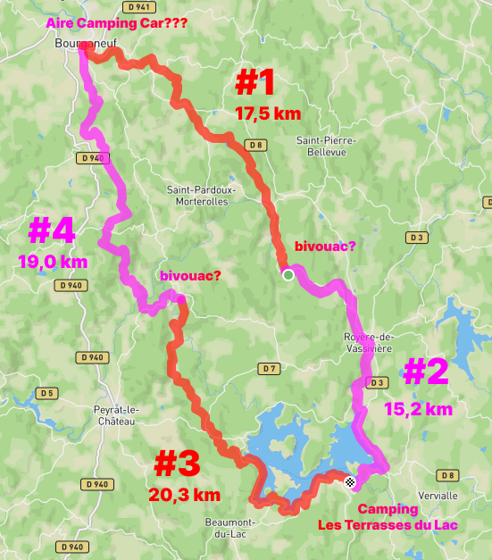

# Randonnée plateau de Millevaches

Sur la base de [cette carte](https://rando-millevaches.fr/trek/730247-GRP%C2%AE65-Cascades,-landes-et-tourbieres),
importée [ici dans komoot](https://www.komoot.com/fr-fr/tour/1756525362), il est 
proposé ce découpage : 

## Description :

Départ de Bourganeuf, 4 étapes, 3 nuits (hors départ / arrivées: bivouac - camping - bivouac). 
Un peu moins d'une vingtaine de kilomètres par jour. Possibilité de 
doubler la nuit autour du Lac de Vassivière (camping).

Peu de camping dans la région, à Bourganeuf même il n'y a pas de camping municipal
mais seulement [une aire de camping car](https://www.google.fr/maps/place/Aire+de+camping-car+Bourganeuf/@45.9541632,1.7575906,18.82z/data=!4m6!3m5!1s0x47f9738d1cb8f93b:0xdd0cdefb35fbc23a!8m2!3d45.9543571!4d1.7572191!16s%2Fg%2F11jv734tpq?entry=ttu)
pas sûr qu'on puisse y planter des tentes.

En adaptant le parcours on pourrait partir du [camping "Les Quatres Saisons" à Chignat](https://www.google.fr/maps/place/The+four+Seasons/@45.946376,1.8119375,16.58z/data=!4m9!3m8!1s0x47f973f5156d7c41:0x9d0852c5446ad4e7!5m2!4m1!1i2!8m2!3d45.9488602!4d1.81286!16s%2Fg%2F1tf47hwf?entry=ttu) 
(7km de Bourganeuf)...
mais il est "temporairement" fermé.

Hors Bourganeuf, il n'y a de camping qu'au Lac de Vassivière ce qui oblige à bivouaquer 
2 nuits (dans une campagne clairsemée avec des forêts, des clairières).

---

## étape #1
Bourganeuf - Le Picq  
- 17,5 km  
- [komoot.com/tour/1756659979](https://www.komoot.com/tour/1756659979)
- Bivouac du coté de [Le Picq](https://www.google.fr/maps/@45.8670399,1.8678321,3a,90y,170.16h,94.27t/data=!3m6!1e1!3m4!1ssMmQFQR_ZbJ-CokjIlc7OA!2e0!7i16384!8i8192?coh=205409&entry=ttu)  
  

---

## étape #2
Le Picq - Les Terrasses du Lac  
- 15,2 km  
- [komoot.com/tour/1756687454](https://www.komoot.com/tour/1756687454)
- [Camping Les Terrasses du Lac](https://www.camping-vassiviere.fr/)
  - 110€ / nuit 4 adultes, 4 enfants

---

## étape #3
Les Terrasses du Lac - Saint Martin Château  
- 20,3 km  
- [komoot.com/tour/1756712245](https://www.komoot.com/tour/1756712245)
- Bivouac

---

## étape #4
Saint Martin Château - Bourganeuf  
- 19,0 km  
- [komoot.com/tour/1756723134](https://www.komoot.com/tour/1756723134)
- Aire Camping Car ???